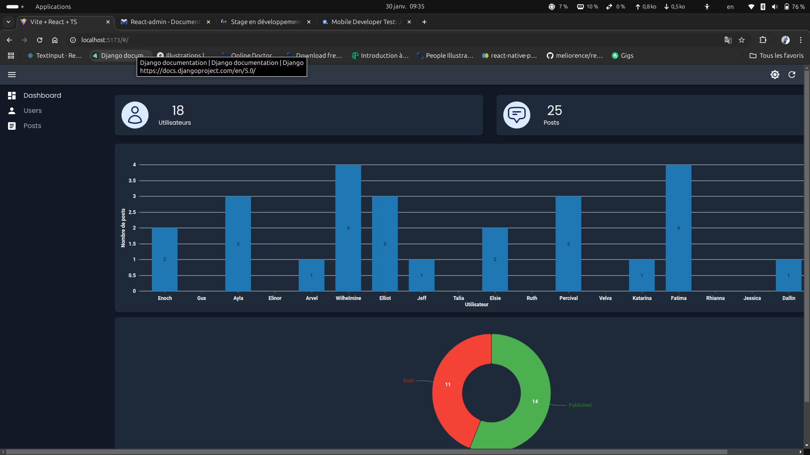
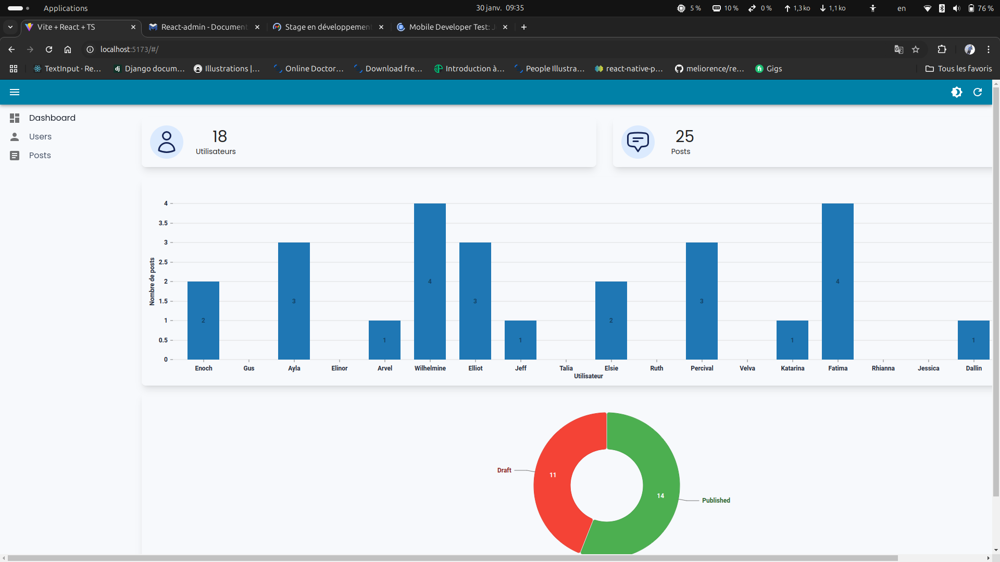

# Test Front

Ce projet est une application front-end développée dans le cadre de l'obtention d'un stage . L'objectif principal de ce projet est de tester et de simuler le comportement d'une interface utilisateur dans un environnement fictif en utilisant des technologies modernes telles que React admin et Node.js json-server.



## Prérequis

Avant de pouvoir exécuter ce projet, vous devez avoir installé Node.js et npm. Pour cela, vous pouvez télécharger Node.js [ici](https://nodejs.org/).

-   Node.js >= 16.x de préference la dernière version
-   npm (inclus avec Node.js)

## Installation

1. Clonez ce dépôt sur votre machine locale.

    ```bash
    git clone https://github.com/jeanronald22/test-front.git
    ```

2. Accédez au répertoire du projet.

    ```bash
    cd test-front
    ```

3. Installez les dépendances avec npm.

    ```bash
    npm install
    ```

4. Créer les données fictifs que nous avons créer avec un script
    ```bash
    npm run migrate
    ```

## Lancer le projet

### : Démarrer avec le serveur Node.js

nous utilisons ici json-server et node pour simuler l'API et ajouter des entête requis pour le bon fonctionnement refére le fichier server.js

```bash
 npm run serve
```

### : Lancer le projet

```bash
 npm run dev
```
